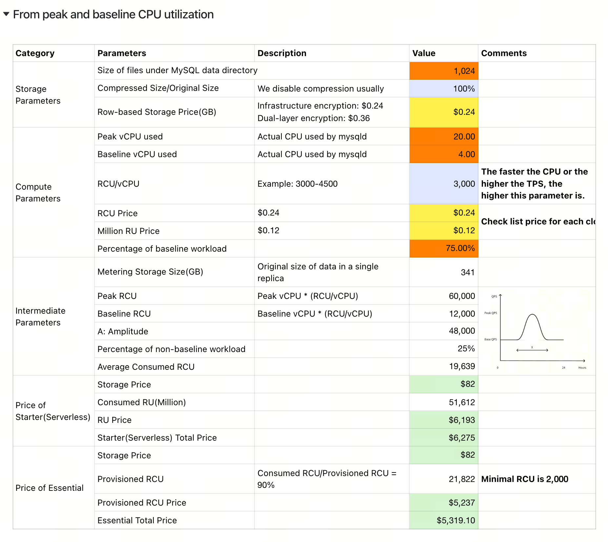
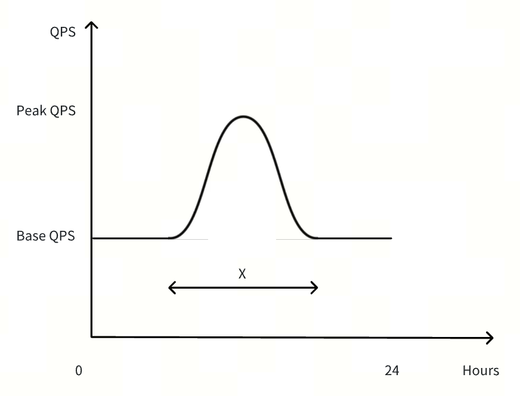

# Architecture

## System Overview

I want to replicate this spreadsheet of pricing calculator as a web version

And we assume the MySQL workload is like a typical bursty pattern similar to a Sine curve.

## How this spreadsheet work

In this spreadsheet calculator :

### Color code

- Orange: required customer workload data as input
- Blue: optional parameters
- Yellow: our list price of RCU/mo, 1M RU/mo and TiKV (row-based storage)
- Green: pricing results

### How other values are calculated

#### Intermediate Parameters

- Metering Storage Size(GB): `[Size of files under MySQL data directory] / 3 / [Compressed Size/Original Size]`
- Peak RCU: `[Peak vCPU used] * [RCU per vCPU]`
- Baseline RCU: `[Baseline vCPU used] * [RCU per vCPU]`
- Amplitude: `[Peak RCU] - [Baseline RCU]`
- Percentage of non-baseline workload: `1 - [Percentage of baseline workload]`
- Average Consumed RCU: `[Baseline vCPU used] * 1 + [Percentage of baseline workload] * [Amplitude] * 2 / PI()`

#### Price of Starter(Serverless)

- Storage Price: `[Metering Storage Size(GB)] * [Row-based Storage Price(GB)]`
- Consumed RU(Million): `[Average Consumed RCU] * 3600 * 730  / 1000000`
- RU Price: `[Consumed RU(Million)] * [Million RU Price]`
- Starter(Serverless) Total Price: `[Storage Price] + [RU Price]`

### Price of Essential

- Storage Price: `[Metering Storage Size(GB)] * [Row-based Storage Price(GB)]`
- Provisioned RCU: `MAX([Average Consumed RCU] / 0.9, 2000)`
- Provisioned RCU Price: `[Provisioned RCU] * [RCU Price]`
- Essential Total Price: `[Storage Price] + [Provisioned RCU Price]`

### Cloud provider and region multipliers

#### Essential

**Alibaba Cloud**

| Resource                                                    | Jakarta | Mexico | Singapore | Tokyo |
| ----------------------------------------------------------- | ------- | ------ | --------- | ----- |
| Compute (Million RU price ($ / 1M RU))                      | $0.14   | $0.21  | $0.12     | $0.14 |
| Compute (RCU price ($ / RCU-month))                         | $0.27   | $0.22  | $0.24     | $0.28 |
| Row-based storage ($ / GB-month)                            | $0.24   | $0.24  | $0.24     | $0.24 |
| Row-based storage with dual-layer encryption ($ / GB-month) | $0.36   | $0.36  | $0.36     | $0.36 |

**AWS**

| Resource                                                    | Oregon | Virginia | Singapore | Tokyo |
| ----------------------------------------------------------- | ------ | -------- | --------- | ----- |
| Compute (Million RU price ($ / 1M RU))                      | $0.1   | $0.1     | $0.12     | $0.12 |
| Compute (RCU price ($ / RCU-month))                         | $0.2   | $0.2     | $0.24     | $0.28 |
| Row-based storage ($ / GB-month)                            | $0.2   | $0.2     | $0.24     | $0.24 |
| Row-based storage with dual-layer encryption ($ / GB-month) | $0.3   | $0.3     | $0.36     | $0.36 |

## Key Decisions

- Why we chose this framework
- Trade-offs made
- Open questions / risks

## Future Extensions

Ideas for scaling or evolving.
